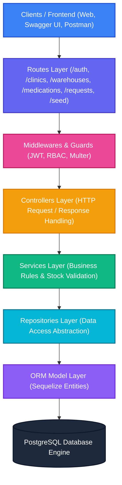
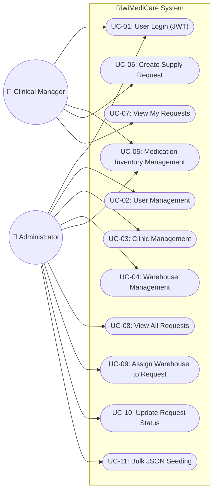
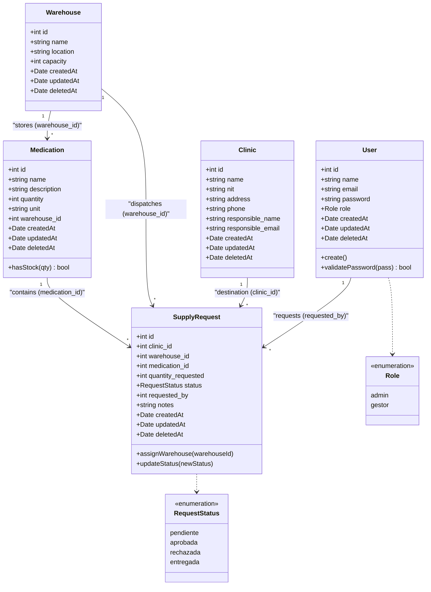
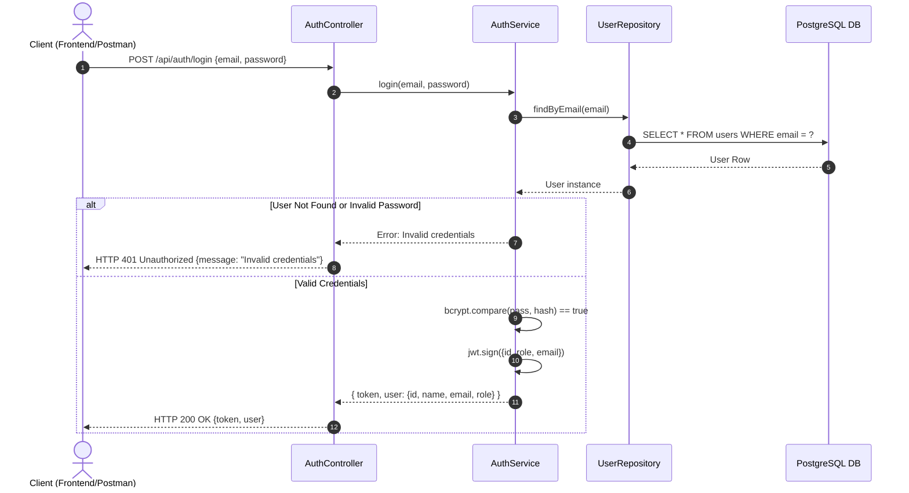
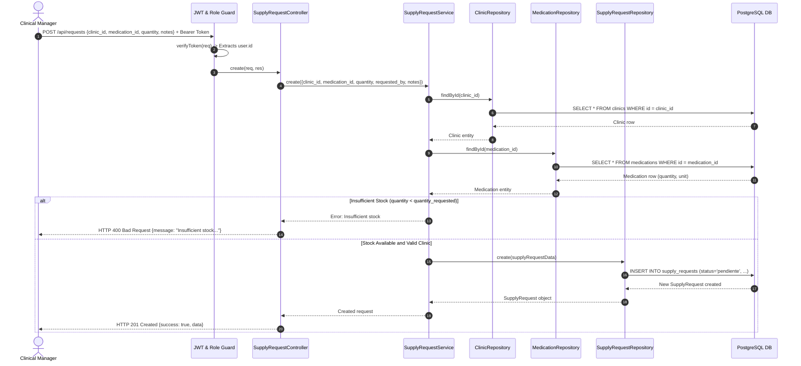
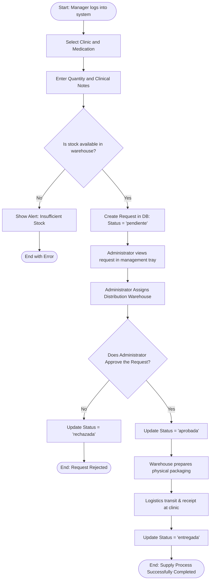
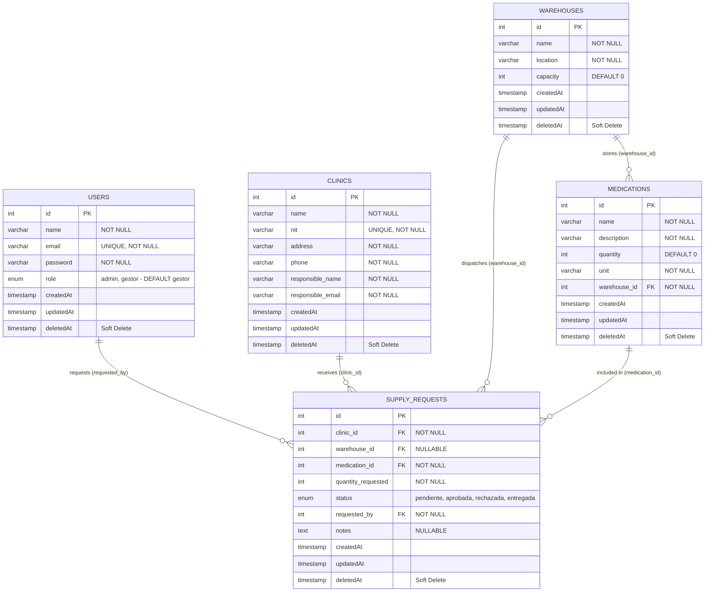

# SOFTWARE DESIGN DOCUMENTATION - RIWIMEDICARE
**Labor Competency Standard:** 220501095 - Design software solutions in accordance with technical procedures and requirements.  
**Project:** RiwiMediCare - Comprehensive Medical Supply Chain System  
**Developer:** Brayan Lozada  
**Clan:** NodeJS / NestJS AM  
**Document Version:** 1.0.0  
**Date:** September 2026  

---

## TABLE OF CONTENTS
1. [PRODUCT 1: SOFTWARE DESIGN DOCUMENT](#1-product-1-software-design-document)
   - 1.1 System Introduction
   - 1.2 Problem Statement
   - 1.3 System Objectives (General and Specific)
   - 1.4 System Actors and Roles
   - 1.5 Functional and Non-Functional Requirements
   - 1.6 Software Architecture and Design Patterns
   - 1.7 Detailed Module Descriptions
   - 1.8 Technology Stack Rationale
2. [PRODUCT 2: UML DIAGRAMS](#2-product-2-uml-diagrams)
   - 2.1 Use Case Diagram
   - 2.2 Domain Class Diagram
   - 2.3 Sequence Diagrams
   - 2.4 Activity Diagram (Supply Request Lifecycle Flow)
3. [PRODUCT 3: SOFTWARE PROTOTYPES (WIREFRAMES & UI/UX)](#3-product-3-software-prototypes)
   - 3.1 User Navigation Flow Map
   - 3.2 Wireframe 1: Login and Authentication
   - 3.3 Wireframe 2: Operational Dashboard and Metrics
   - 3.4 Wireframe 3: Medication Inventory and Catalog
   - 3.5 Wireframe 4: Supply Request Creation Form
   - 3.6 Wireframe 5: Dispatch Management and Approval Tray
   - 3.7 Style and Usability Guide (UI/UX)
4. [PRODUCT 4: DATABASE MODEL](#4-product-4-database-model)
   - 4.1 Entity-Relationship Diagram (ERD)
   - 4.2 Comprehensive Data Dictionary
   - 4.3 PostgreSQL DDL Relational Script
5. [CONCLUSIONS AND TRACEABILITY MATRIX](#5-conclusions-and-traceability-matrix)

---

# 1. PRODUCT 1: SOFTWARE DESIGN DOCUMENT

## 1.1 System Introduction
**RiwiMediCare** is an enterprise technology platform dedicated to the management, supervision, and optimization of the medical supply chain for affiliated healthcare clinics and hospitals. The solution centralizes distributed inventories across multiple warehouses and automates the supply request lifecycle from initial formulation to physical dispatch and clinical delivery.

## 1.2 Problem Statement
In healthcare logistics, inefficient pharmaceutical supply tracking leads to critical shortages, product expiration overhead, lack of order traceability, and approval bottlenecks. Traditional manual processes lack:
- Real-time inventory verification prior to order placement.
- Strict Role-Based Access Control between warehouse administrators and clinical managers.
- Transparent audit history for request statuses (Pending, Approved, Rejected, Delivered).
- Automated bulk loading capabilities for initial catalogs and inventories.

RiwiMediCare solves these problems with a clean, layered RESTful API enforcing real-time stock validation, referential integrity, and token-based security.

## 1.3 System Objectives

### General Objective
Design and implement a scalable, modular, and secure software solution for centralized medical supply management between distribution warehouses and clinical centers, ensuring end-to-end traceability, automatic stock checks, and role-based access control.

### Specific Objectives
1. **Security & User Management:** Implement stateless authentication with JWT and one-way bcrypt hashing for Administrator and Clinical Manager roles.
2. **Core Entity Administration:** Centralize the management of clinics, warehouses, and medication catalogs.
3. **Supply Lifecycle Automation:** Process supply requests with atomic stock verification and state transitions (`pendiente` $\rightarrow$ `aprobada` / `rechazada` $\rightarrow$ `entregada`).
4. **Fast Initialization:** Provide bulk JSON ingestion endpoints (Seeders) with duplicate prevention.
5. **Standardized Documentation:** Publish OpenAPI 3.0 interactive documentation via Swagger UI.

## 1.4 System Actors and Roles

| Actor / Role | Description and Responsibilities |
| :--- | :--- |
| **System Administrator (`admin`)** | Superuser in charge of global administration. Manages clinics, warehouses, medication catalogs, views all supply requests, assigns distribution warehouses, approves/rejects requests, and executes bulk seeders. |
| **Clinical Manager (`gestor`)** | Healthcare clinic representative. Browses medication catalog and available stock, creates supply requests for their clinic, and tracks request status. |
| **System / Database Engine** | Computational entity executing concurrency checks, business invariant validation (minimum stock $> 0$), ACID persistence, and token verification. |

---

## 1.5 Functional and Non-Functional Requirements

### Functional Requirements (FR)

| Code | Requirement Name | Description | Allowed Role |
| :--- | :--- | :--- | :--- |
| **FR-01** | Authentication & Token Generation | Validate email/password credentials and issue a signed JWT access token with defined expiration. | All Users |
| **FR-02** | User Registration | Register users with name, unique email, bcrypt-hashed password, and assigned role. | Administrator |
| **FR-03** | Clinic Management | Create, retrieve, list, and update healthcare clinics (Name, unique Tax ID/NIT, address, phone, contact details). | Administrator |
| **FR-04** | Warehouse Management | Manage distribution warehouses with name, location, and storage capacity. | Administrator |
| **FR-05** | Medication Inventory Management | Register, list, and update medications assigned to warehouses with stock levels and units of measure. | Administrator (Write) / Manager (Read) |
| **FR-06** | Supply Request Creation | Clinical managers create orders specifying clinic, medication, and requested quantity with real-time stock validation. | Clinical Manager |
| **FR-07** | Warehouse Assignment | Administrator assigns or reassigns the warehouse responsible for supplying a request. | Administrator |
| **FR-08** | Request Status Control | Administrator transitions request status between `pendiente`, `aprobada`, `rechazada`, and `entregada`. | Administrator |
| **FR-09** | Request Filtering & Queries | Managers view their own requests (`/my`), administrators view global or active requests (`/active`). | Admin / Manager |
| **FR-10** | Bulk JSON Seeder | Upload JSON files via `multipart/form-data` to seed users, clinics, warehouses, or medications. | Administrator |

### Non-Functional Requirements (NFR)

| Code | Category | Acceptance Criteria |
| :--- | :--- | :--- |
| **NFR-01** | **Security** | Bcrypt password hashing (10 salt rounds). JWT authentication and RBAC guards on all protected routes. |
| **NFR-02** | **Performance** | Average query response time $\le 200$ ms under standard load. Indexed queries in PostgreSQL. |
| **NFR-03** | **Availability** | Docker Compose containerization ensuring high portability and uptime $\ge 99.9\%$. |
| **NFR-04** | **Maintainability** | TypeScript codebase with strict typing, structured in clean layers (Routes $\rightarrow$ Controllers $\rightarrow$ Services $\rightarrow$ Repositories $\rightarrow$ Models). |
| **NFR-05** | **Data Integrity** | ACID compliance in PostgreSQL. Soft Deletes (`paranoid: true`) for historical auditing. |
| **NFR-06** | **Scalability** | Stateless REST API supporting horizontal scaling behind load balancers. |
| **NFR-07** | **Documentation** | Interactive OpenAPI 3.0 specification via Swagger UI at `/api/docs`. |
| **NFR-08** | **Error Handling** | Standardized JSON responses with semantic HTTP status codes. |

---

## 1.6 Software Architecture and Design Patterns

The system implements a **Layered Architecture** combined with the **Repository Pattern**:



---

# 2. PRODUCT 2: UML DIAGRAMS

## 2.1 Use Case Diagram



---

## 2.2 Domain Class Diagram



---

## 2.3 Sequence Diagrams

### Sequence Diagram 1: User Login & JWT Authentication



---

### Sequence Diagram 2: Supply Request Creation with Real-Time Stock Validation



---

## 2.4 Activity Diagram (Supply Request Lifecycle)



---

# 4. PRODUCT 4: DATABASE MODEL

## 4.1 Entity-Relationship Diagram (ERD)



---

## 4.2 Comprehensive Data Dictionary

### Table 1: `users`
| Field Name | Data Type | Nullable | Key | Default | Description |
| :--- | :--- | :---: | :---: | :--- | :--- |
| `id` | `INTEGER` | NO | PK | Auto-increment | Primary key. |
| `name` | `VARCHAR(255)`| NO | - | - | Full user name. |
| `email` | `VARCHAR(255)`| NO | UQ | - | Unique email address. |
| `password` | `VARCHAR(255)`| NO | - | - | Bcrypt hashed password. |
| `role` | `ENUM` | NO | - | `'gestor'` | User role: `'admin'` or `'gestor'`. |
| `createdAt` | `TIMESTAMP` | NO | - | `CURRENT_TIMESTAMP` | Row creation timestamp. |
| `updatedAt` | `TIMESTAMP` | NO | - | `CURRENT_TIMESTAMP` | Row update timestamp. |
| `deletedAt` | `TIMESTAMP` | YES | - | `NULL` | Soft delete timestamp. |

---

### Table 2: `clinics`
| Field Name | Data Type | Nullable | Key | Default | Description |
| :--- | :--- | :---: | :---: | :--- | :--- |
| `id` | `INTEGER` | NO | PK | Auto-increment | Primary key. |
| `name` | `VARCHAR(255)`| NO | - | - | Clinic entity name. |
| `nit` | `VARCHAR(255)`| NO | UQ | - | Unique Tax Identification Number. |
| `address` | `VARCHAR(255)`| NO | - | - | Physical clinic address. |
| `phone` | `VARCHAR(255)`| NO | - | - | Contact phone number. |
| `responsible_name` | `VARCHAR(255)` | NO | - | - | Medical director / manager name. |
| `responsible_email`| `VARCHAR(255)` | NO | - | - | Contact email. |
| `createdAt` | `TIMESTAMP` | NO | - | `CURRENT_TIMESTAMP` | Row creation timestamp. |
| `updatedAt` | `TIMESTAMP` | NO | - | `CURRENT_TIMESTAMP` | Row update timestamp. |
| `deletedAt` | `TIMESTAMP` | YES | - | `NULL` | Soft delete timestamp. |

---

### Table 3: `warehouses`
| Field Name | Data Type | Nullable | Key | Default | Description |
| :--- | :--- | :---: | :---: | :--- | :--- |
| `id` | `INTEGER` | NO | PK | Auto-increment | Primary key. |
| `name` | `VARCHAR(255)`| NO | - | - | Warehouse name. |
| `location` | `VARCHAR(255)`| NO | - | - | Geographic logistics location. |
| `capacity` | `INTEGER` | NO | - | `0` | Storage capacity in units. |
| `createdAt` | `TIMESTAMP` | NO | - | `CURRENT_TIMESTAMP` | Row creation timestamp. |
| `updatedAt` | `TIMESTAMP` | NO | - | `CURRENT_TIMESTAMP` | Row update timestamp. |
| `deletedAt` | `TIMESTAMP` | YES | - | `NULL` | Soft delete timestamp. |

---

### Table 4: `medications`
| Field Name | Data Type | Nullable | Key | Default | Description |
| :--- | :--- | :---: | :---: | :--- | :--- |
| `id` | `INTEGER` | NO | PK | Auto-increment | Primary key. |
| `name` | `VARCHAR(255)`| NO | - | - | Generic and trade medication name. |
| `description`| `VARCHAR(255)`| NO | - | - | Dosage and therapeutic details. |
| `quantity` | `INTEGER` | NO | - | `0` | Available stock in warehouse ($\ge 0$). |
| `unit` | `VARCHAR(255)`| NO | - | - | Unit of measure (Boxes, Tablets, etc.). |
| `warehouse_id` | `INTEGER` | NO | FK | - | Foreign key to `warehouses(id)`. |
| `createdAt` | `TIMESTAMP` | NO | - | `CURRENT_TIMESTAMP` | Row creation timestamp. |
| `updatedAt` | `TIMESTAMP` | NO | - | `CURRENT_TIMESTAMP` | Row update timestamp. |
| `deletedAt` | `TIMESTAMP` | YES | - | `NULL` | Soft delete timestamp. |

---

### Table 5: `supply_requests`
| Field Name | Data Type | Nullable | Key | Default | Description |
| :--- | :--- | :---: | :---: | :--- | :--- |
| `id` | `INTEGER` | NO | PK | Auto-increment | Primary key. |
| `clinic_id` | `INTEGER` | NO | FK | - | Foreign key to `clinics(id)`. |
| `warehouse_id` | `INTEGER` | YES | FK | `NULL` | Assigned warehouse (`warehouses(id)`). |
| `medication_id`| `INTEGER` | NO | FK | - | Requested medication (`medications(id)`). |
| `quantity_requested`|`INTEGER`| NO | - | - | Requested quantity ($> 0$). |
| `status` | `ENUM` | NO | - | `'pendiente'` | Status: `'pendiente'`, `'aprobada'`, `'rechazada'`, `'entregada'`. |
| `requested_by` | `INTEGER` | NO | FK | - | Requester user ID (`users(id)`). |
| `notes` | `TEXT` | YES | - | `NULL` | Clinical justification notes. |
| `createdAt` | `TIMESTAMP` | NO | - | `CURRENT_TIMESTAMP` | Request emission timestamp. |
| `updatedAt` | `TIMESTAMP` | NO | - | `CURRENT_TIMESTAMP` | Last status update timestamp. |
| `deletedAt` | `TIMESTAMP` | YES | - | `NULL` | Soft delete timestamp. |

---

## 4.3 PostgreSQL DDL Relational Script

```sql
-- PostgreSQL DDL for RiwiMediCare (Compatible with Sequelize ORM)

CREATE TYPE enum_users_role AS ENUM ('admin', 'gestor');
CREATE TYPE enum_supply_requests_status AS ENUM ('pendiente', 'aprobada', 'rechazada', 'entregada');

CREATE TABLE users (
    id SERIAL PRIMARY KEY,
    name VARCHAR(255) NOT NULL,
    email VARCHAR(255) NOT NULL UNIQUE,
    password VARCHAR(255) NOT NULL,
    role enum_users_role NOT NULL DEFAULT 'gestor',
    "createdAt" TIMESTAMP WITH TIME ZONE NOT NULL DEFAULT NOW(),
    "updatedAt" TIMESTAMP WITH TIME ZONE NOT NULL DEFAULT NOW(),
    "deletedAt" TIMESTAMP WITH TIME ZONE
);

CREATE TABLE clinics (
    id SERIAL PRIMARY KEY,
    name VARCHAR(255) NOT NULL,
    nit VARCHAR(255) NOT NULL UNIQUE,
    address VARCHAR(255) NOT NULL,
    phone VARCHAR(255) NOT NULL,
    responsible_name VARCHAR(255) NOT NULL,
    responsible_email VARCHAR(255) NOT NULL,
    "createdAt" TIMESTAMP WITH TIME ZONE NOT NULL DEFAULT NOW(),
    "updatedAt" TIMESTAMP WITH TIME ZONE NOT NULL DEFAULT NOW(),
    "deletedAt" TIMESTAMP WITH TIME ZONE
);

CREATE TABLE warehouses (
    id SERIAL PRIMARY KEY,
    name VARCHAR(255) NOT NULL,
    location VARCHAR(255) NOT NULL,
    capacity INTEGER NOT NULL DEFAULT 0,
    "createdAt" TIMESTAMP WITH TIME ZONE NOT NULL DEFAULT NOW(),
    "updatedAt" TIMESTAMP WITH TIME ZONE NOT NULL DEFAULT NOW(),
    "deletedAt" TIMESTAMP WITH TIME ZONE
);

CREATE TABLE medications (
    id SERIAL PRIMARY KEY,
    name VARCHAR(255) NOT NULL,
    description VARCHAR(255) NOT NULL,
    quantity INTEGER NOT NULL DEFAULT 0,
    unit VARCHAR(255) NOT NULL,
    warehouse_id INTEGER NOT NULL,
    "createdAt" TIMESTAMP WITH TIME ZONE NOT NULL DEFAULT NOW(),
    "updatedAt" TIMESTAMP WITH TIME ZONE NOT NULL DEFAULT NOW(),
    "deletedAt" TIMESTAMP WITH TIME ZONE,
    CONSTRAINT fk_medication_warehouse FOREIGN KEY (warehouse_id) REFERENCES warehouses (id) ON UPDATE CASCADE ON DELETE RESTRICT
);

CREATE TABLE supply_requests (
    id SERIAL PRIMARY KEY,
    clinic_id INTEGER NOT NULL,
    warehouse_id INTEGER,
    medication_id INTEGER NOT NULL,
    quantity_requested INTEGER NOT NULL CHECK (quantity_requested > 0),
    status enum_supply_requests_status NOT NULL DEFAULT 'pendiente',
    requested_by INTEGER NOT NULL,
    notes TEXT,
    "createdAt" TIMESTAMP WITH TIME ZONE NOT NULL DEFAULT NOW(),
    "updatedAt" TIMESTAMP WITH TIME ZONE NOT NULL DEFAULT NOW(),
    "deletedAt" TIMESTAMP WITH TIME ZONE,
    CONSTRAINT fk_request_clinic FOREIGN KEY (clinic_id) REFERENCES clinics (id) ON UPDATE CASCADE ON DELETE RESTRICT,
    CONSTRAINT fk_request_warehouse FOREIGN KEY (warehouse_id) REFERENCES warehouses (id) ON UPDATE CASCADE ON DELETE SET NULL,
    CONSTRAINT fk_request_medication FOREIGN KEY (medication_id) REFERENCES medications (id) ON UPDATE CASCADE ON DELETE RESTRICT,
    CONSTRAINT fk_request_user FOREIGN KEY (requested_by) REFERENCES users (id) ON UPDATE CASCADE ON DELETE RESTRICT
);

CREATE INDEX idx_users_email ON users(email);
CREATE INDEX idx_medications_warehouse ON medications(warehouse_id);
CREATE INDEX idx_supply_requests_status ON supply_requests(status);
CREATE INDEX idx_supply_requests_clinic ON supply_requests(clinic_id);
CREATE INDEX idx_supply_requests_user ON supply_requests(requested_by);
```

---

# 5. CONCLUSIONS AND TRACEABILITY MATRIX

| Deliverable Item | Evidence Covered in Document | Status |
| :--- | :--- | :---: |
| **1. Design Document** | Introduction, problem statement, objectives, actors, 10 FRs, 8 NFRs, layered architecture, and technology rationale. | ✅ Complete |
| **2. UML Diagrams** | Use Case Diagram, Domain Class Diagram, 2 Sequence Diagrams (Login and Request Creation), and Activity Diagram. | ✅ Complete |
| **3. Software Prototype** | Navigation map, 5 detailed Wireframes, and UI/UX style guide. | ✅ Complete |
| **4. Database Model** | Entity-Relationship Diagram (ERD), comprehensive Data Dictionary (5 tables), and PostgreSQL DDL script with indexes. | ✅ Complete |
