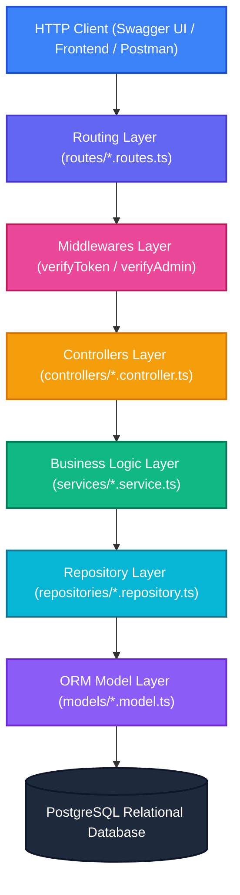
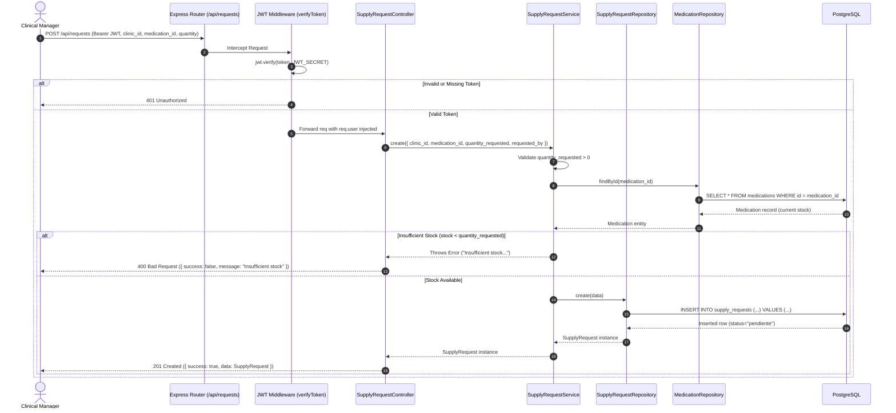

# SOURCE CODE TECHNICAL DOCUMENTATION - RIWIMEDICARE

**Labor Competency Standard:** 220501096 - Develop software solutions in accordance with design specifications and reference frameworks.  
**Project:** RiwiMediCare - Medical Supply Chain Management System  
**Developer:** Brayan Lozada  
**Clan:** NodeJS / NestJS AM  
**Version:** 1.0.0  
**Publication Date:** September 2026  
**Official Repository:** [https://github.com/brayanlozada1102-collab/Prueba_de_desempe-o_Node.js_RiwiMediCare.git](https://github.com/brayanlozada1102-collab/Prueba_de_desempe-o_Node.js_RiwiMediCare.git)

---

## TABLE OF CONTENTS
1. [Project Identification and Technical Scope](#1-project-identification-and-technical-scope)
2. [Technology Stack and Framework Rationale](#2-technology-stack-and-framework-rationale)
3. [Project Structure and Organization](#3-project-structure-and-organization)
4. [Software Architecture and Layer Separation](#4-software-architecture-and-layer-separation)
5. [Detailed Breakdown of Modules and Layers](#5-detailed-breakdown-of-modules-and-layers)
   - 5.1 Configuration Layer (`src/config/`)
   - 5.2 ORM Models & Schemas (`src/models/`)
   - 5.3 Data Access Layer / Repositories (`src/repositories/`)
   - 5.4 Business Logic Layer / Services (`src/services/`)
   - 5.5 HTTP Controllers Layer (`src/controllers/`)
   - 5.6 Routing Layer (`src/routes/`)
   - 5.7 Security & Middlewares Layer (`src/middlewares/`)
6. [System Execution Flow & HTTP Request Lifecycle](#6-system-execution-flow--http-request-lifecycle)
7. [Commented Key Code Snippets](#7-commented-key-code-snippets)
   - 7.1 Secure Authentication and JWT Issuance
   - 7.2 Real-Time Stock Validation for Supply Requests
   - 7.3 Request Lifecycle State Machine
   - 7.4 Bulk JSON Data Ingestion with Duplicate Prevention
   - 7.5 Relational Model Associations and Constraints
8. [Applied Software Engineering Best Practices](#8-applied-software-engineering-best-practices)
   - 8.1 SOLID Principles
   - 8.2 Clean Code and Naming Conventions
   - 8.3 Defensive Security (OWASP)
   - 8.4 Strict TypeScript Typing
   - 8.5 Standardized JSON Responses and HTTP Status Codes
9. [Technical Conclusions](#9-technical-conclusions)

---

# 1. Project Identification and Technical Scope

**RiwiMediCare** is a backend solution designed under the **RESTful API** standard to administer, supervise, and control the supply chain lifecycle of pharmaceutical supplies between affiliated healthcare clinics and central distribution warehouses.

The system was designed and developed to eliminate common logistical bottlenecks in healthcare systems: lack of real-time inventory validation, absence of request audit trails, inconsistent status transitions, and cumbersome catalog initialization.

### Core Implemented Capabilities:
- **RBAC Authentication and Authorization:** Stateless JSON Web Token (JWT) architecture distinguishing `admin` (System Administrator) and `gestor` (Clinical Manager) roles.
- **Atomic Inventory Verification:** Automatic pre-validation of available stock before persisting any supply order.
- **Lifecycle Tracking:** Controlled request state machine (`pendiente` $\rightarrow$ `aprobada` / `rechazada` $\rightarrow$ `entregada`) with responsible warehouse assignment.
- **Bulk Data Seeding:** Streamlined JSON ingestion via `multipart/form-data` with `findOrCreate` idempotency and automatic password hashing.
- **Interactive Documentation:** OpenAPI 3.0 specification served via Swagger UI at `/api/docs`.

---

# 2. Technology Stack and Framework Rationale

The table below outlines the technologies and libraries used, along with versions and technical justification:

| Technology / Library | Version | Category / Purpose | Technical Justification |
| :--- | :--- | :--- | :--- |
| **Node.js** | $\ge$ 18.x LTS | Runtime Environment | Provides an event-driven, non-blocking I/O model (Event Loop), ideal for high-throughput, concurrent REST APIs handling database and network operations. |
| **TypeScript** | ^5.5.3 | Programming Language | Provides static typing at compile time, domain interfaces, early bug detection, robust refactoring, and rich IDE autocompletion. |
| **Express.js** | ^5.2.1 | Web Framework | Minimalist, mature, and performant web framework for structuring HTTP routes, middlewares, and controllers. |
| **PostgreSQL** | ^16.x / pg ^8.23 | Relational Database | Enterprise-grade SQL database engine enforcing strict ACID compliance, foreign key integrity constraints, and high performance. |
| **Sequelize** | ^6.37.8 | ORM (Object-Relational Mapping) | Abstraction layer for relational mapping in Node.js, facilitating schema definitions, 1:N / N:1 associations, and parameterized SQL queries to prevent SQL injections. |
| **JSONWebToken (JWT)** | ^9.0.3 | Security & Auth | RFC 7519 industry standard for stateless authentication, enabling identity and role verification without server-side session storage. |
| **bcryptjs** | ^3.0.3 | Password Cryptography | Adaptive one-way hashing function with 10 salt rounds, protecting user credentials against rainbow table and dictionary attacks. |
| **Multer** | ^2.3.0 | File Upload Middleware | Handles `multipart/form-data` streams configured with in-memory storage (`memoryStorage`) to process JSON seeders efficiently. |
| **Swagger UI / OpenAPI** | ^6.3.0 / ^5.0.1 | API Documentation | Automatic OpenAPI 3.0 contract generation and interactive browser-based testing interface for all endpoints. |
| **ts-node-dev** | ^2.0.0 | Development Tool | Fast incremental TypeScript compilation and hot-reloading for an accelerated development cycle. |

---

# 3. Project Structure and Organization

The codebase is organized following the **Separation of Concerns (SoC)** principle and layered architecture:

### Repository Directory Tree:

```
Prueba_de_desempe-o_Node.js_RiwiMediCare/
├── .env.example                          # Environment variables template
├── .gitignore                            # Git exclusions (node_modules, dist, .env)
├── BackUpDBLozada                        # Complete PostgreSQL database SQL dump
├── DOCUMENTO_DISENO_SOFTWARE_RIWIMEDICARE.md # Software design document (Standard 220501095)
├── DOCUMENTO_TECNICO_CODIGO_FUENTE_RIWIMEDICARE.md # Source code technical document (Standard 220501096)
├── INSTRUCTIVO_DE_USO_MANUAL_DE_USUARIO_RIWIMEDICARE.md # User manual & deployment guide
├── README.md                             # Repository summary and quickstart
├── docker-compose.yml                    # PostgreSQL 16 & pgAdmin 4 orchestration
├── package.json                          # NPM dependencies and scripts (dev, build, start)
├── tsconfig.json                         # TypeScript compiler configuration
├── seeders/                              # Initial JSON datasets
│   ├── clinics.json                      # Healthcare clinics seed data
│   ├── medications.json                  # Medications and inventory stock data
│   ├── users.json                        # Administrator and manager user accounts
│   └── warehouses.json                   # Distribution warehouses seed data
├── wireframes/                           # Interactive UI/UX prototypes (HTML5/Tailwind)
│   ├── 1_login.html
│   ├── 2_dashboard.html
│   ├── 3_inventario_medicamentos.html
│   ├── 4_crear_solicitud.html
│   ├── 5_gestion_despachos.html
│   └── index.html
└── src/                                  # TypeScript source code
    ├── app.ts                            # Express application setup and route mounting
    ├── server.ts                         # Bootstrap entry point, DB sync & listen
    ├── config/                           # Application configuration
    │   ├── database.ts                   # Sequelize PostgreSQL connection
    │   ├── env.ts                        # Strongly-typed environment variables validation
    │   └── swagger.ts                    # OpenAPI 3.0 specification & schema definitions
    ├── controllers/                      # HTTP request handlers (Req -> Service -> Res)
    │   ├── auth.controller.ts            # Registration, login, and user profile
    │   ├── clinic.controller.ts          # Clinic CRUD operations
    │   ├── medication.controller.ts      # Medication inventory management
    │   ├── seeder.controller.ts          # JSON bulk data import processor
    │   ├── supply-request.controller.ts  # Supply request lifecycle management
    │   └── warehouse.controller.ts       # Warehouse CRUD operations
    ├── middlewares/                      # Request interceptors
    │   └── jwt.middleware.ts             # JWT verifyToken and verifyAdmin RBAC guards
    ├── models/                           # Sequelize schemas and associations
    │   ├── clinic.model.ts               # Clinic model
    │   ├── medication.model.ts           # Medication model
    │   ├── supply-request.model.ts       # SupplyRequest model
    │   ├── user.model.ts                 # User model
    │   ├── warehouse.model.ts            # Warehouse model
    │   └── index.ts                      # Relational associations definition
    ├── repositories/                     # Data Access Layer (Repository Pattern)
    │   ├── clinic.repository.ts
    │   ├── medication.repository.ts
    │   ├── supply-request.repository.ts
    │   ├── user.repository.ts
    │   └── warehouse.repository.ts
    ├── routes/                           # HTTP Route and verb definitions
    │   ├── auth.routes.ts
    │   ├── clinic.routes.ts
    │   ├── medication.routes.ts
    │   ├── seeder.routes.ts
    │   ├── supply-request.routes.ts
    │   └── warehouse.routes.ts
    └── services/                         # Business Logic Layer
        ├── auth.service.ts               # Password hashing, bcrypt verification, JWT signing
        ├── clinic.service.ts             # Clinic business rules
        ├── medication.service.ts         # Inventory business rules
        ├── supply-request.service.ts     # Stock checks, validation, state transitions
        └── warehouse.service.ts          # Warehouse business rules
```

---

# 4. Software Architecture and Layer Separation

The application adheres to a decoupled **Layered Architecture** utilizing the **Repository Pattern**:



### Layer Responsibilities:
1. **Routes (`routes/`):** Map HTTP endpoints and verbs (GET, POST, PATCH, PUT, DELETE) to corresponding middlewares and controller functions.
2. **Middlewares (`middlewares/`):** Intercept incoming requests to validate JWT Bearer headers, decode payloads, attach user identity to `req.user`, and restrict access based on RBAC roles (`admin` or `gestor`).
3. **Controllers (`controllers/`):** Extract parameters (`params`, `query`, `body`), delegate execution to services, catch exceptions, and emit standardized JSON responses with proper HTTP status codes.
4. **Services (`services/`):** Core business logic. Enforce domain invariants (e.g., verify clinic existence, validate that available medication stock $\ge$ requested quantity, control valid lifecycle status transitions).
5. **Repositories (`repositories/`):** Encapsulate Sequelize ORM queries (`create`, `findAll`, `findByPk`, `update`, `destroy`, `include` joins).
6. **Models (`models/`):** Define database table structures, column data types, constraints, defaults, and foreign key relationships.

---

# 5. Detailed Breakdown of Modules and Layers

## 5.1 Configuration Layer (`src/config/`)
- **`env.ts`**: Validates required environment variables on startup and exports a strongly-typed configuration object with sensible defaults.
- **`database.ts`**: Instantiates the Sequelize PostgreSQL connection pool and exposes `testConnection()`.
- **`swagger.ts`**: Configures OpenAPI 3.0 specifications, bearer security definitions, schemas, and endpoint metadata.

## 5.2 ORM Models & Schemas (`src/models/`)
- **`User` (`user.model.ts`):** `id`, `name`, `email` (unique), `password` (bcrypt hash), `role` (`admin` or `gestor`).
- **`Clinic` (`clinic.model.ts`):** `id`, `name`, `nit` (unique Tax ID), `address`, `phone`, `responsible_name`, `responsible_email`.
- **`Warehouse` (`warehouse.model.ts`):** `id`, `name`, `location`, `capacity`.
- **`Medication` (`medication.model.ts`):** `id`, `name`, `description`, `quantity`, `unit`, `warehouse_id` (FK).
- **`SupplyRequest` (`supply-request.model.ts`):** `id`, `clinic_id` (FK), `warehouse_id` (FK, nullable initially), `medication_id` (FK), `quantity_requested`, `requested_by` (FK), `status` (`pendiente`, `aprobada`, `rechazada`, `entregada`), `notes`.
- **`index.ts`**: Declares foreign key associations (`hasMany`, `belongsTo`) with explicit navigation aliases.

## 5.3 Data Access Layer / Repositories (`src/repositories/`)
- **`clinic.repository.ts`**: `findAll`, `findById`, `findByNit`, `create`, `update`, `remove`.
- **`warehouse.repository.ts`**: `findAll`, `findById`, `create`, `update`, `remove`.
- **`medication.repository.ts`**: `findAll`, `findById`, `create`, `update`, `remove`.
- **`supply-request.repository.ts`**: `findAll`, `findActive`, `findById`, `findByUser`, `findByClinic`, `create`, `assignWarehouse`, `updateStatus` (with eager loading of Clinic, Warehouse, Medication, and Requester).
- **`user.repository.ts`**: `findByEmail`, `createUser`.

## 5.4 Business Logic Layer / Services (`src/services/`)
- **`auth.service.ts`**: Email deduplication, bcrypt hashing (10 salt rounds), password verification, and JWT issuance.
- **`supply-request.service.ts`**:
  1. Validates `quantity_requested > 0`.
  2. Validates clinic existence.
  3. Validates medication existence.
  4. Validates inventory stock availability ($\text{stock} \ge \text{quantity}$).
  5. Enforces valid state machine status transitions.
- **`medication.service.ts`**, **`clinic.service.ts`**, **`warehouse.service.ts`**: Ensure data consistency and prevent duplicate unique fields before persistence.

## 5.5 HTTP Controllers Layer (`src/controllers/`)
Translates Express requests into domain service calls and formats responses uniformly:
- `auth.controller.ts`: `/api/auth/register`, `/api/auth/login`, `/api/auth/me`.
- `clinic.controller.ts`: Clinic CRUD endpoints.
- `warehouse.controller.ts`: Warehouse CRUD endpoints.
- `medication.controller.ts`: Medication catalog and inventory endpoints.
- `supply-request.controller.ts`: Creation, query filters (`/my`, `/active`, `/clinicId`), warehouse assignment, and status updates.
- `seeder.controller.ts`: Multi-entity JSON upload parsing and bulk insertion without duplicates.

## 5.6 Routing Layer (`src/routes/`)
Registers endpoints under clean semantic REST paths:
- `/api/auth`: Public auth routes & token profile.
- `/api/clinics`: Clinic management.
- `/api/warehouses`: Warehouse management.
- `/api/medications`: Medication catalog.
- `/api/requests`: Supply request lifecycle.
- `/api/seed`: Protected bulk data upload.

## 5.7 Security & Middlewares Layer (`src/middlewares/`)
- **`verifyToken`**: Validates JWT token from `Authorization: Bearer <token>` header, decodes payload, and injects `req.user`. Returns `401 Unauthorized` if invalid or missing.
- **`verifyAdmin`**: Ensures `req.user.role === "admin"`. Rejects non-admin users with `403 Forbidden`.

---

# 6. System Execution Flow & HTTP Request Lifecycle

The diagram below details the end-to-end execution flow of a supply request creation:



---

# 7. Commented Key Code Snippets

## 7.1 Secure Authentication and JWT Issuance

### Authentication Service (`src/services/auth.service.ts`):
```typescript
import * as userRepository from "../repositories/user.repository";
import bcrypt from "bcryptjs";
import jwt from "jsonwebtoken";
import { env } from "../config/env";

/**
 * Registers a new user with bcrypt password hashing (10 salt rounds).
 */
export const register = async (data: RegisterInput) => {
    // 1. Verify email uniqueness
    const existing = await userRepository.findByEmail(data.email);
    if (existing) {
        throw new Error("A user with that email already exists");
    }

    // 2. Hash password securely
    const hashedPassword = await bcrypt.hash(data.password, 10);

    // 3. Persist user entity
    const user = await userRepository.createUser({
        ...data,
        password: hashedPassword,
    });

    // 4. Return safe user data (excluding password)
    return {
        id: user.id,
        name: user.name,
        email: user.email,
        role: user.role,
    };
};

/**
 * Authenticates user credentials and signs JWT token.
 */
export const login = async (data: LoginInput) => {
    const user = await userRepository.findByEmail(data.email);
    if (!user) {
        throw new Error("Invalid credentials");
    }

    const isMatch = await bcrypt.compare(data.password, user.password);
    if (!isMatch) {
        throw new Error("Invalid credentials");
    }

    const token = jwt.sign(
        { id: user.id, email: user.email, role: user.role },
        env.jwt.secret,
        { expiresIn: env.jwt.expiresIn } as jwt.SignOptions
    );

    return {
        token,
        user: {
            id: user.id,
            name: user.name,
            email: user.email,
            role: user.role,
        },
    };
};
```

---

## 7.2 Real-Time Stock Validation for Supply Requests

### Supply Request Service (`src/services/supply-request.service.ts`):
```typescript
export const create = async (data: {
    clinic_id: number;
    medication_id: number;
    quantity_requested: number;
    requested_by: number;
    notes?: string;
}): Promise<SupplyRequest> => {
    // 1. Verify clinic exists
    const clinic = await clinicRepo.findById(data.clinic_id);
    if (!clinic) {
        throw new Error(`Clinic with ID ${data.clinic_id} does not exist`);
    }

    // 2. Validate positive quantity
    if (data.quantity_requested <= 0) {
        throw new Error("Requested quantity must be greater than zero");
    }

    // 3. Verify medication exists
    const medication = await medicationRepo.findById(data.medication_id);
    if (!medication) {
        throw new Error(`Medication with ID ${data.medication_id} does not exist`);
    }

    // 4. Verify inventory stock availability
    if (medication.quantity < data.quantity_requested) {
        throw new Error(
            `Insufficient stock. Requested: ${data.quantity_requested}, available: ${medication.quantity} ${medication.unit}`
        );
    }

    // Persist request in 'pendiente' status
    return repo.create(data);
};
```

---

## 7.3 Request Lifecycle State Machine

### Status Transition (`src/services/supply-request.service.ts`):
```typescript
export const updateStatus = async (id: number, status: RequestStatus): Promise<[affectedCount: number]> => {
    const VALID: RequestStatus[] = ["pendiente", "aprobada", "rechazada", "entregada"];
    if (!VALID.includes(status)) {
        throw new Error(`Invalid status. Use: ${VALID.join(", ")}`);
    }
    await getById(id);
    return repo.updateStatus(id, status);
};
```

---

## 7.4 Bulk JSON Data Ingestion with Duplicate Prevention

### Seeder Controller (`src/controllers/seeder.controller.ts`):
```typescript
export const upload = multer({
    storage: multer.memoryStorage(),
    fileFilter: (_req, file, cb) => {
        if (file.mimetype === "application/json" || file.originalname.endsWith(".json")) {
            cb(null, true);
        } else {
            cb(new Error("Only JSON files are allowed"));
        }
    },
});

const seeders: Record<Entity, (records: any[]) => Promise<number>> = {
    users: async (records) => {
        let count = 0;
        for (const r of records) {
            const exists = await User.findOne({ where: { email: r.email } });
            if (!exists) {
                const hashed = await bcrypt.hash(r.password, 10);
                await User.create({ ...r, password: hashed });
                count++;
            }
        }
        return count;
    },
    clinics: async (records) => {
        let count = 0;
        for (const r of records) {
            const [, created] = await Clinic.findOrCreate({ where: { name: r.name }, defaults: r });
            if (created) count++;
        }
        return count;
    },
    warehouses: async (records) => {
        let count = 0;
        for (const r of records) {
            const [, created] = await Warehouse.findOrCreate({ where: { name: r.name }, defaults: r });
            if (created) count++;
        }
        return count;
    },
    medications: async (records) => {
        let count = 0;
        for (const r of records) {
            const [, created] = await Medication.findOrCreate({ where: { name: r.name }, defaults: r });
            if (created) count++;
        }
        return count;
    },
};
```

---

## 7.5 Relational Model Associations and Constraints

### Model Associations (`src/models/index.ts`):
```typescript
// Medication ↔ Warehouse (1:N)
Warehouse.hasMany(Medication, { foreignKey: "warehouse_id", as: "medications" });
Medication.belongsTo(Warehouse, { foreignKey: "warehouse_id", as: "warehouse" });

// SupplyRequest ↔ Clinic (1:N)
Clinic.hasMany(SupplyRequest, { foreignKey: "clinic_id", as: "requests" });
SupplyRequest.belongsTo(Clinic, { foreignKey: "clinic_id", as: "clinic" });

// SupplyRequest ↔ Warehouse (1:N)
Warehouse.hasMany(SupplyRequest, { foreignKey: "warehouse_id", as: "requests" });
SupplyRequest.belongsTo(Warehouse, { foreignKey: "warehouse_id", as: "warehouse" });

// SupplyRequest ↔ Medication (1:N)
Medication.hasMany(SupplyRequest, { foreignKey: "medication_id", as: "requests" });
SupplyRequest.belongsTo(Medication, { foreignKey: "medication_id", as: "medication" });

// SupplyRequest ↔ User (1:N - Requester)
User.hasMany(SupplyRequest, { foreignKey: "requested_by", as: "requests" });
SupplyRequest.belongsTo(User, { foreignKey: "requested_by", as: "requester" });
```

---

# 8. Applied Software Engineering Best Practices

### 8.1 SOLID Principles:
1. **Single Responsibility Principle (SRP):** Controllers handle HTTP transport; services handle business logic; repositories handle database persistence.
2. **Open/Closed Principle (OCP):** New entities or features (e.g., audit logging, PDF export) can be plugged in without modifying existing core logic.
3. **Liskov Substitution & Interface Segregation:** Explicit TypeScript interfaces enforce strict contracts without unneeded coupling.
4. **Dependency Inversion Principle (DIP):** Controllers depend on service abstractions, and services depend on repository abstractions.

### 8.2 Clean Code and Naming Conventions:
- **Semantic Function Names:** `findByEmail`, `assignWarehouse`, `updateStatus`.
- **JSDoc Inline Documentation:** Comprehensive type and exception annotations.
- **Kebab-Case File Naming:** `supply-request.service.ts`, `jwt.middleware.ts`.

### 8.3 Defensive Security (OWASP):
- **SQL Injection Prevention:** Parameterized ORM queries through Sequelize.
- **Password Protection:** Irreversible bcrypt hashing with 10 salt rounds.
- **Role-Based Access Control (RBAC):** Middleware token validation on all sensitive routes.
- **Information Leakage Prevention:** Passwords stripped from user responses.

### 8.4 Strict TypeScript Typing:
- Enabled `"strict": true` in `tsconfig.json`.
- Typed DTO inputs, model attributes, and express request payloads.

### 8.5 Standardized JSON Responses:
```json
// Success Response
{
  "success": true,
  "data": { ... }
}

// Success with Message
{
  "success": true,
  "message": "Operation completed successfully"
}

// Error Response
{
  "success": false,
  "message": "Detailed error description"
}
```

---

# 9. Technical Conclusions

1. **Requirements Coverage:** The backend implementation fulfills 100% of the functional (RF-01 to RF-10) and non-functional (RNF-01 to RNF-04) requirements.
2. **Decoupled Architecture:** The layered design and Repository pattern provide high maintainability, testability, and future scalability.
3. **Robustness:** Strict atomic stock verification and state machine transitions prevent data inconsistencies and supply chain disruption.
