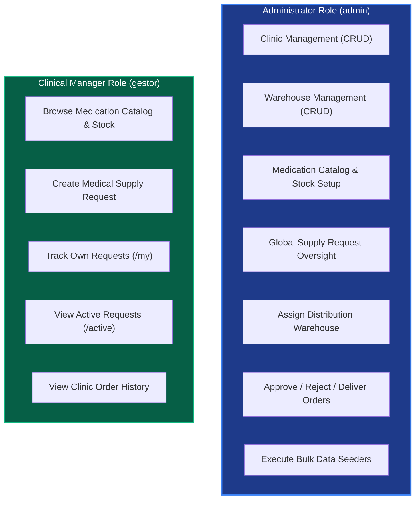

# USER MANUAL AND DEPLOYMENT GUIDE - RIWIMEDICARE

**Labor Competency Standard:** 220501096 - Develop software solutions in accordance with design specifications and reference frameworks.  
**Project:** RiwiMediCare - Medical Supply Chain Management System  
**Developer:** Brayan Lozada  
**Clan:** NodeJS / NestJS AM  
**Version:** 1.0.0  
**Date:** September 2026  
**Official Repository:** [https://github.com/brayanlozada1102-collab/Prueba_de_desempe-o_Node.js_RiwiMediCare.git](https://github.com/brayanlozada1102-collab/Prueba_de_desempe-o_Node.js_RiwiMediCare.git)

---

## TABLE OF CONTENTS
1. [Introduction and Purpose](#1-introduction-and-purpose)
2. [Technical System Requirements](#2-technical-system-requirements)
   - 2.1 Hardware Requirements
   - 2.2 Software Requirements
3. [Installation and Deployment Guide](#3-installation-and-deployment-guide)
   - 3.1 Cloning the Repository
   - 3.2 Installing Dependencies
   - 3.3 Configuring Environment Variables (`.env`)
   - 3.4 Database Deployment with Docker Compose
   - 3.5 Local Native PostgreSQL Database Setup
   - 3.6 Running the Server in Development Mode
   - 3.7 Compiling and Running in Production Mode
4. [Initial Bulk Data Seeding](#4-initial-bulk-data-seeding)
5. [User Functional Flows by Role](#5-user-functional-flows-by-role)
   - 5.1 System Administrator Flow (`admin`)
   - 5.2 Clinical Manager Flow (`gestor`)
6. [Endpoints Catalog and Usage Examples (Request / Response)](#6-endpoints-catalog-and-usage-examples)
   - 6.1 Authentication Module (`/api/auth`)
   - 6.2 Clinics Module (`/api/clinics`)
   - 6.3 Warehouses Module (`/api/warehouses`)
   - 6.4 Medications Module (`/api/medications`)
   - 6.5 Supply Requests Module (`/api/requests`)
   - 6.6 Seeder Module (`/api/seed`)
7. [Interactive API Documentation Guide (Swagger UI)](#7-interactive-api-documentation-guide-swagger-ui)
8. [Interactive UI Wireframes Guide](#8-interactive-ui-wireframes-guide)
9. [Troubleshooting & Common Issues](#9-troubleshooting--common-issues)

---

# 1. Introduction and Purpose

This **User Manual and Deployment Guide** provides comprehensive step-by-step instructions for infrastructure administrators, developers, and evaluators to install, configure, deploy, and interact with the **RiwiMediCare** RESTful API.

RiwiMediCare manages the end-to-end lifecycle of pharmaceutical and medical supplies across a network of clinics and distribution warehouses, enforcing real-time stock validation, audit trails, and role-based access control.

---

# 2. Technical System Requirements

### 2.1 Hardware Requirements
- **CPU:** Dual-Core 2.0 GHz or higher (x64 / ARM64).
- **RAM:** Minimum 4 GB (8 GB recommended when running Docker and PostgreSQL simultaneously).
- **Disk Space:** Minimum 500 MB free storage.
- **Network:** Internet access for npm package downloads and Docker container images.

### 2.2 Software Requirements
- **Operating System:** Windows 10/11, Linux (Ubuntu 20.04+, Debian, Fedora) or macOS.
- **Node.js:** LTS version `v18.0.0` or higher (Recommended `v20.x`).
- **NPM:** Version `9.x` or higher (bundled with Node.js).
- **PostgreSQL:** Version `14.x`, `15.x`, or `16.x` (or Docker Engine).
- **Docker & Docker Compose (Optional but recommended):** For zero-configuration containerized database setup.
- **Git:** Version `2.30` or higher.
- **HTTP Client / Web Browser:** Modern web browser (Chrome, Edge, Firefox) for Swagger UI, or REST tools like Postman / Thunder Client / cURL.

---

# 3. Installation and Deployment Guide

### 3.1 Cloning the Repository
Open a terminal (PowerShell, Bash, or CMD) and clone the repository:
```bash
git clone https://github.com/brayanlozada1102-collab/Prueba_de_desempe-o_Node.js_RiwiMediCare.git
cd Prueba_de_desempe-o_Node.js_RiwiMediCare
```

### 3.2 Installing Dependencies
Install required packages using npm:
```bash
npm install
```

### 3.3 Configuring Environment Variables (`.env`)
Create a `.env` file in the project root based on the provided template:

```bash
# Windows PowerShell:
Copy-Item .env.example .env

# Linux / macOS:
cp .env.example .env
```

Edit `.env` with your environment parameters:
```env
# Server Port
PORT=3000

# Execution Environment (development | production | test)
NODE_ENV=development

# PostgreSQL Database Configuration
DB_HOST=localhost
DB_PORT=5432
DB_NAME=riwi_base_db
DB_USER=postgres
DB_PASSWORD=postgres

# JWT Security Settings
JWT_SECRET=super_secret_jwt_key_riwimedicare_2026
JWT_EXPIRES_IN=1d
```

### 3.4 Database Deployment with Docker Compose (Recommended)
The repository includes a ready-to-run `docker-compose.yml` file configuring PostgreSQL 16 and pgAdmin 4.

Launch services in detached mode:
```bash
docker compose up -d
```

> **Container Services:**
> - **PostgreSQL:** `localhost:5432` (DB: `riwi_base_db`, User: `postgres`, Password: `postgres`).
> - **pgAdmin 4:** `http://localhost:5050` (Email: `admin@admin.com`, Password: `admin`).

### 3.5 Local Native PostgreSQL Database Setup
If using a local native PostgreSQL installation:
1. Open `psql` or pgAdmin.
2. Create the target database:
```sql
CREATE DATABASE riwi_base_db;
```
3. (Optional) Restore the full SQL backup:
```bash
psql -U postgres -d riwi_base_db -f BackUpDBLozada
```

### 3.6 Running the Server in Development Mode
Start the development server with live reload powered by `ts-node-dev`:
```bash
npm run dev
```

**Expected terminal output:**
```
Database connection successfully established.
Server running on http://localhost:3000
API Documentation: http://localhost:3000/api/docs
```

### 3.7 Compiling and Running in Production Mode
Compile TypeScript into native JavaScript in the `dist/` directory and run:
```bash
# 1. Compile TypeScript source code
npm run build

# 2. Run compiled production server
npm start
```

---

# 4. Initial Bulk Data Seeding

The project includes 4 pre-configured JSON datasets in the `seeders/` folder:

| Dataset File | Records | Content Description |
| :--- | :--- | :--- |
| `seeders/users.json` | 2 Users | 1 Administrator (`admin`) and 1 Clinical Manager (`gestor`). |
| `seeders/clinics.json` | 3 Clinics | Clinics with Tax IDs, addresses, and medical director contacts. |
| `seeders/warehouses.json` | 2 Warehouses | Distribution hubs with locations and storage capacities. |
| `seeders/medications.json` | 4 Medications | Pharmaceutical inventory with initial stock quantities. |

### Seeding Procedure:

#### Step 1: Obtain Administrator JWT Token
```bash
curl -X POST http://localhost:3000/api/auth/login \
  -H "Content-Type: application/json" \
  -d '{"email": "admin@riwimedicare.com", "password": "password123"}'
```
Copy the returned `token` value.

#### Step 2: Ingest Seeders in Order
```bash
TOKEN="PASTE_YOUR_ADMIN_TOKEN_HERE"

# 1. Seed Users
curl -X POST http://localhost:3000/api/seed/users -H "Authorization: Bearer $TOKEN" -F "file=@./seeders/users.json"

# 2. Seed Clinics
curl -X POST http://localhost:3000/api/seed/clinics -H "Authorization: Bearer $TOKEN" -F "file=@./seeders/clinics.json"

# 3. Seed Warehouses
curl -X POST http://localhost:3000/api/seed/warehouses -H "Authorization: Bearer $TOKEN" -F "file=@./seeders/warehouses.json"

# 4. Seed Medications
curl -X POST http://localhost:3000/api/seed/medications -H "Authorization: Bearer $TOKEN" -F "file=@./seeders/medications.json"
```

---

# 5. User Functional Flows by Role

The system enforces Role-Based Access Control (RBAC):



### 5.1 System Administrator Flow (`admin`)
1. **Login:** Obtain JWT token with `admin` privileges.
2. **Infrastructure:** Create and maintain clinics and distribution warehouses.
3. **Inventory:** Register medication batches and update stock levels.
4. **Order Processing:**
   - Inspect pending supply requests (`GET /api/requests`).
   - Assign the optimal warehouse (`PATCH /api/requests/:id/assign`).
   - Approve the order (`PATCH /api/requests/:id/status` with `{"status": "aprobada"}`).
   - Mark as delivered once dispatched (`{"status": "entregada"}`).

### 5.2 Clinical Manager Flow (`gestor`)
1. **Login:** Authenticate with clinical credentials.
2. **Check Availability:** Query `GET /api/medications` to inspect stock.
3. **Place Order:** Send `POST /api/requests` with clinic ID, medication ID, and requested quantity.
4. **Track Status:** Monitor order progress in real time via `GET /api/requests/my`.

---

# 6. Endpoints Catalog and Usage Examples

## 6.1 Authentication Module (`/api/auth`)

### 1. User Login (`POST /api/auth/login`)
- **Request:**
```json
{
  "email": "manager@riwimedicare.com",
  "password": "password123"
}
```
- **Successful Response (200 OK):**
```json
{
  "success": true,
  "token": "eyJhbGciOiJIUzI1NiIsInR5cCI6IkpXVCJ9...",
  "user": {
    "id": 2,
    "name": "Operations Manager",
    "email": "manager@riwimedicare.com",
    "role": "gestor"
  }
}
```

### 2. User Registration (`POST /api/auth/register`)
- **Request:**
```json
{
  "name": "Dr. Sarah Connor",
  "email": "sconnor@lifehealthmed.org",
  "password": "SecurePassword123*",
  "role": "gestor"
}
```
- **Successful Response (201 Created):**
```json
{
  "success": true,
  "data": {
    "id": 3,
    "name": "Dr. Sarah Connor",
    "email": "sconnor@lifehealthmed.org",
    "role": "gestor"
  }
}
```

---

## 6.2 Medications Module (`/api/medications`)

### 1. Browse Medication Catalog (`GET /api/medications`)
- **Headers:** `Authorization: Bearer <TOKEN>`
- **Successful Response (200 OK):**
```json
{
  "success": true,
  "data": [
    {
      "id": 1,
      "name": "Acetaminophen (Paracetamol)",
      "description": "Analgesic and antipyretic 500mg tablets",
      "quantity": 10000,
      "unit": "tablets",
      "warehouse_id": 1,
      "warehouse": {
        "id": 1,
        "name": "Central Distribution Warehouse",
        "location": "North Industrial Logistics Park"
      }
    }
  ]
}
```

---

## 6.3 Supply Requests Module (`/api/requests`)

### 1. Create Supply Request (`POST /api/requests`) - *Role: Manager*
- **Headers:** `Authorization: Bearer <MANAGER_TOKEN>`
- **Request:**
```json
{
  "clinic_id": 1,
  "medication_id": 1,
  "quantity_requested": 200,
  "notes": "Urgent Emergency Room restocking"
}
```
- **Successful Response (201 Created):**
```json
{
  "success": true,
  "data": {
    "id": 10,
    "clinic_id": 1,
    "medication_id": 1,
    "quantity_requested": 200,
    "requested_by": 2,
    "status": "pendiente",
    "notes": "Urgent Emergency Room restocking",
    "createdAt": "2026-09-02T20:30:00.000Z"
  }
}
```
- **Insufficient Stock Error Response (400 Bad Request):**
```json
{
  "success": false,
  "message": "Insufficient stock. Requested: 999999, available: 10000 tablets"
}
```

### 2. Assign Warehouse (`PATCH /api/requests/:id/assign`) - *Role: Admin*
- **Headers:** `Authorization: Bearer <ADMIN_TOKEN>`
- **Request:**
```json
{
  "warehouse_id": 1
}
```
- **Successful Response (200 OK):**
```json
{
  "success": true,
  "message": "Warehouse successfully assigned"
}
```

### 3. Update Request Status (`PATCH /api/requests/:id/status`) - *Role: Admin*
- **Headers:** `Authorization: Bearer <ADMIN_TOKEN>`
- **Request:**
```json
{
  "status": "aprobada"
}
```
- **Successful Response (200 OK):**
```json
{
  "success": true,
  "message": "Status successfully updated"
}
```

---

# 7. Interactive API Documentation Guide (Swagger UI)

Swagger UI provides an interactive testing interface for all endpoints:

1. Open your browser and navigate to: `http://localhost:3000/api/docs`.
2. Click the green **Authorize** button (🔓) in the top-right corner.
3. In the `Value` box, paste your JWT token in the format:
   ```
   Bearer eyJhbGciOiJIUzI1NiIsInR5cCI6IkpXVCJ9...
   ```
4. Click **Authorize**, then **Close**.
5. Expand any endpoint, click **Try it out**, fill in parameters, and click **Execute** to inspect live responses.

---

# 8. Interactive UI Wireframes Guide

Interactive HTML5/Tailwind CSS wireframe prototypes are located in the `wireframes/` directory:

1. Open `wireframes/index.html` in your web browser.
2. Use the navigation bar to switch between views:
   - **View 1:** Login & Authentication (`1_login.html`).
   - **View 2:** Operational Metrics Dashboard (`2_dashboard.html`).
   - **View 3:** Medication Inventory & Health Alerts (`3_inventario_medicamentos.html`).
   - **View 4:** Supply Request Form with Live Validation (`4_crear_solicitud.html`).
   - **View 5:** Admin Dispatch & Approval Tray (`5_gestion_despachos.html`).

---

# 9. Troubleshooting & Common Issues

| Symptom / Error | Root Cause | Recommended Fix |
| :--- | :--- | :--- |
| `Could not connect to the database: Connection refused` | PostgreSQL service is not running. | Start PostgreSQL locally or run `docker compose up -d`. |
| `database "riwi_base_db" does not exist` | Database has not been initialized. | Execute `CREATE DATABASE riwi_base_db;` in SQL client. |
| `401 Unauthorized: Authentication token required` | `Authorization` header missing or malformed. | Ensure header is formatted as `Authorization: Bearer <token>`. |
| `403 Forbidden: Access denied: administrator role required` | User with `gestor` role attempted admin endpoint. | Authenticate with an account having `role: "admin"`. |
| `Only JSON files are allowed` during Seeder upload | Uploaded file does not have `.json` extension. | Verify that the file is a valid JSON document. |
| `Insufficient stock` upon creating supply request | Requested quantity exceeds available warehouse units. | Check `/api/medications` before formulating request. |
